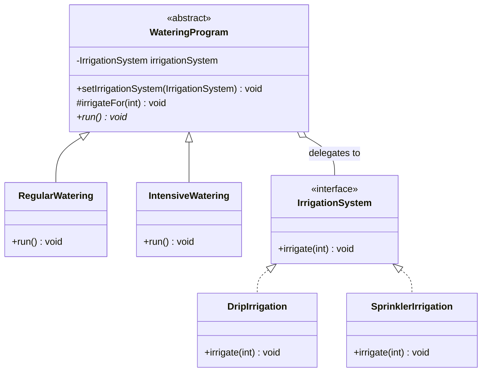

# Greenhouse Watering with the Bridge Pattern

Software Design Patterns, Assignment 3. Author: [chinusoid](https://github.com/chinusoid).

This Java console application separates **watering programs** from **irrigation systems**.
Regular watering lasts 5 minutes and intensive watering lasts 15 minutes. Either program
can use drip irrigation or sprinklers, and its system can be replaced at runtime.
The devices are simulated with console messages; the program does not operate real hardware.

## Project structure

```text
sdp-assignment-3-bridge/
├── pom.xml
├── README.md
├── .gitignore
└── src/
    ├── main/java/chinusoid/greenhouse/
    │   ├── Main.java
    │   ├── WateringProgram.java
    │   ├── RegularWatering.java
    │   ├── IntensiveWatering.java
    │   ├── IrrigationSystem.java
    │   ├── DripIrrigation.java
    │   ├── SprinklerIrrigation.java
    │   └── IrrigationOutput.java
    └── test/java/chinusoid/greenhouse/
        └── BridgeVerification.java
```

## Run with a JDK

Requires JDK 17 or newer. There are no application or test dependencies.
Run the following commands from the project root on Linux or macOS:

```bash
mkdir -p target/classes
javac --release 17 -encoding UTF-8 -d target/classes src/main/java/chinusoid/greenhouse/*.java
java -cp target/classes chinusoid.greenhouse.Main
```

On Windows PowerShell, replace the directory command with:

```powershell
New-Item -ItemType Directory -Force target/classes
```

Then use the same `javac` and `java` commands. You can also open `pom.xml` in IntelliJ IDEA,
select JDK 17 or newer as the project SDK, and run `Main.main()`.

If Maven is available:

```bash
mvn package
java -jar target/sdp-assignment-3-bridge-1.0.0.jar
```

## Expected output

```text
Greenhouse watering - Bridge pattern

Regular program + drip system
Drip irrigation: watering for 5 minutes.

Regular program + sprinkler system
Sprinkler irrigation: watering for 5 minutes.

Intensive program + drip system
Drip irrigation: watering for 15 minutes.

Intensive program + sprinkler system
Sprinkler irrigation: watering for 15 minutes.

Switching the system on the SAME watering program:
Drip irrigation: watering for 5 minutes.
Sprinkler irrigation: watering for 5 minutes.
```

## Bridge roles

| Role | Class or interface | Responsibility |
| --- | --- | --- |
| Abstraction | `WateringProgram` | Holds an `IrrigationSystem` reference and delegates irrigation operations. |
| Refined Abstraction | `RegularWatering`, `IntensiveWatering` | Define the duration of each program. |
| Implementor | `IrrigationSystem` | Declares the low-level operation `irrigate(int durationMinutes)`. |
| Concrete Implementor | `DripIrrigation`, `SprinklerIrrigation` | Simulate the selected irrigation device. |
| Client | `Main` | Composes all four combinations and changes a system on the same program object. |

`IrrigationOutput` is a package-private helper for shared formatting and duration validation.



The bridge is the reference from `WateringProgram` to `IrrigationSystem`.
The two hierarchies evolve independently: a new watering program extends `WateringProgram`,
and a new device implements `IrrigationSystem`. Existing program classes do not need to
change when a new device is added. The client chooses which objects to connect.

## Runtime switching

```java
WateringProgram program = new RegularWatering(new DripIrrigation());
program.run();
program.setIrrigationSystem(new SprinklerIrrigation());
program.run();
```

Both calls use the same `RegularWatering` object and the same 5-minute duration.
Only its implementation reference changes. No watering program checks a device's
concrete type or branches on the selected irrigation system.

## Clean Code principles

1. **Single Responsibility.** Watering programs define duration, irrigation systems
   simulate devices, and `Main` composes and demonstrates objects.
2. **Dependency Inversion.** `WateringProgram` depends on the `IrrigationSystem` interface,
   so neither watering subclass depends on a concrete device class.
3. **Open/Closed Principle.** A new irrigation device implements the existing interface.
   It can be passed to either program without editing `WateringProgram` or its subclasses.
4. **DRY.** Both simulated devices share output formatting and positive-duration validation
   in `IrrigationOutput`; neither duplicates that logic.
5. **Meaningful Names.** `RegularWatering`, `DripIrrigation`, `durationMinutes`, and
   `setIrrigationSystem` describe their role or purpose directly.
6. **Small, Focused Methods.** `run()` selects the duration and delegates; `irrigate()`
   simulates a single device operation. Named constants replace unexplained durations.

A null implementation is rejected in the constructor and setter. Zero and negative
durations are rejected by both concrete irrigation systems.

## Verification

After compiling the application, compile and run the dependency-free checks:

```bash
mkdir -p target/test-classes
javac --release 17 -encoding UTF-8 -cp target/classes -d target/test-classes src/test/java/chinusoid/greenhouse/*.java
java -cp target/classes:target/test-classes chinusoid.greenhouse.BridgeVerification
```

On Windows, use `;` instead of `:` in the final classpath. The checks verify:

- The two program durations and delegation to an additional test implementation.
- Output for all four program/device combinations.
- Switching implementations on the same object and stopping calls to the old system.
- Rejecting null systems while retaining the previous system after a rejected replacement.
- Rejecting nonpositive durations in both concrete systems.

Successful output: `All 5 Bridge verification groups passed.`

These checks run explicitly through their `main()` method; they are not JUnit tests
and are not automatically executed by `mvn test`.

## Объяснение для защиты

Я разделил режим полива и систему орошения на две независимые иерархии.
Режим определяет длительность, а система выполняет низкоуровневую операцию полива.
Абстрактный класс `WateringProgram` хранит ссылку на интерфейс `IrrigationSystem`:
эта ссылка и является мостом. В `Main` я показываю четыре комбинации, затем меняю
систему у того же объекта режима через `setIrrigationSystem()`.

**Зачем здесь Bridge?** При наследовании отдельного класса для каждой комбинации
пришлось бы создавать `RegularDrip`, `RegularSprinkler`, `IntensiveDrip` и
`IntensiveSprinkler`. Bridge позволяет отдельно добавлять режимы и устройства.

**Как добавить новую систему?** Создать класс, реализующий `IrrigationSystem`, и
передать его в конструктор режима или в `setIrrigationSystem()`. Код режимов менять не нужно.

**Как добавить новый режим?** Унаследовать `WateringProgram` и реализовать `run()`.
Новый режим сразу сможет использовать существующие системы орошения.
